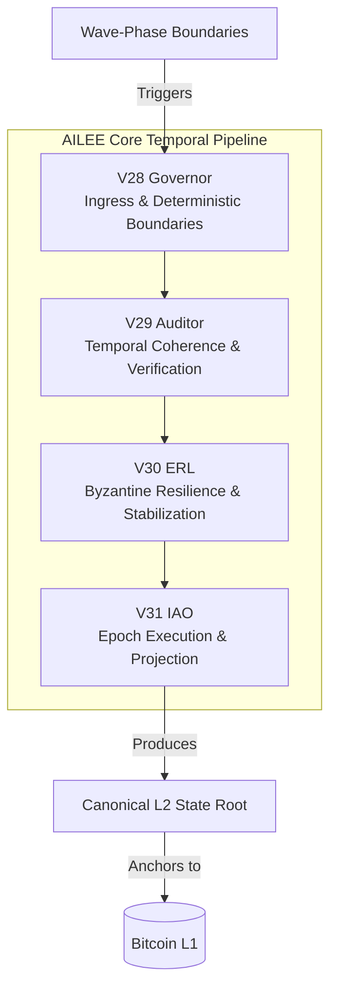

# AILEE Protocol Formalization (V32)

**Document Status:** STANDARDS TRACK (Canonical Protocol Definition)
**Protocol Version:** V32
**Target:** AILEE-Core

## 1. Abstract

This document formalizes AILEE-Core as a canonical Bitcoin Layer-2 protocol. It defines the temporal architecture, execution guarantees, orchestration identity, and evolutionary lineage of the protocol. This specification provides a strictly deterministic operational blueprint—establishing AILEE alongside established protocols like Lightning, Tendermint, and OP Stack—by defining protocol-level invariants without dictating implementation-specific minutiae.

## 2. AILEE Identity Statement

AILEE-Core is a deterministic, federated Bitcoin Layer-2 orchestration protocol. It enforces strict, bit-for-bit reproducible state transitions tied to cryptographic anchors on the Bitcoin base layer, decoupling local wall-clock timing from consensus via a wave-native heartbeat system. As a canonical protocol, AILEE establishes a formal, verifiable execution lineage that provides trust-minimized, replayable state recovery independent of hardware, host operating systems, or local scheduler ambiguity.

## 3. Temporal Architecture Model

The AILEE-Core temporal architecture operates as a strict, sequential four-layer pipeline. It governs how time, execution, and state coherence are enforced across the network.

### 3.1. Layer Definitions

*   **V28 Governor (Ingress & Boundaries):** Establishes the absolute bounds of the protocol from fixed baselines. It provides deterministic parameter adjustment and protocol governance, preventing multi-epoch drift.
*   **V29 Auditor (Verification & Coherence):** Ensures multi-epoch temporal coherence through strict, reproducible metric validations. It mathematically scores state transitions over rolling windows to enforce stability.
*   **V30 Energy Resilience Layer [ERL] (Stabilization):** Manages Byzantine node resilience and resource allocation deterministically. It penalizes unstable actors while ensuring protocol progression under adverse conditions.
*   **V31 Intelligence‑Assisted Orchestration [IAO] (Projection & Execution):** Drives the high-level scheduling and execution of epochs. It integrates state transitions with deterministic ZK proofs and anchored commitments.

### 3.2. Architecture Flow

## 4. Governor Specification

The V28 Governor dictates the ingress of time and the boundaries of execution.

*   **Heartbeat Cadence:** Protocol execution is decoupled from local wall-clock time. Heartbeats are triggered strictly by mathematical wave-phase rollovers.
*   **Epoch Boundaries:** Epochs advance only when a valid deterministic wave-phase boundary is crossed.
*   **Deterministic Ingress:** All external inputs (e.g., L1 block headers, wave states) are quantized into canonical formats before processing. No asynchronous inputs may alter the execution path mid-epoch.
*   **Replay Guarantees:** Because the Governor enforces fixed baselines and phase-triggered boundaries, any historical state can be reconstructed bit-for-bit by re-ingesting the initial genesis state and the historical sequence of wave-phase boundaries.

## 5. Isla Mode Definition

**Isla Mode** is a named, strictly deterministic orchestration behavior within the AILEE-Core pipeline, specifically bridging the ERL and IAO layers.

*   **Forward-Looking Scheduling:** Isla Mode provides deterministic advisory temporal insight by mathematically projecting the resource and coherence requirements of future epochs based on the current Auditor rolling windows.
*   **Strict Constraints:** Isla operates strictly as a pure function of historical and current epoch deterministic state. It is forbidden from introducing entropy, random number generation, or relying on non-reproducible external oracle data.
*   **Temporal Insight:** It yields a deterministic heuristic used by the IAO to optimize proof generation schedules and batching logic, ensuring the protocol remains efficient without compromising the canonical state root.

## 6. Protocol Guarantees

AILEE-Core mathematically and cryptographically guarantees the following invariants, which are currently satisfied by the runtime:

1.  **Deterministic Execution:** Identical initial states and inputs will yield identical outputs across any hardware or operating system. Local scheduler ambiguity and floating-point drift are fully mitigated.
2.  **Reproducible State Transitions:** Every state transition can be audited and rebuilt independently.
3.  **Canonical Roots:** Every completed epoch produces a single, universally agreed-upon SHA-256 hash representing the complete L2 state.
4.  **Replayable Epochs:** The `IReplayBuffer` and strict dependency injection allow full re-execution from any historical anchor point.
5.  **Bitcoin‑Anchored Recovery:** The L2 state root is periodically committed to the Bitcoin base layer via Taproot or OP_RETURN, establishing trust-minimized, immutable checkpoints.
6.  **Zero‑Stub Cryptography:** Cryptographic operations (hashing, signature verification, deterministic proof commitments) utilize rigorous, standard implementations without relying on placeholder behavior in production environments.

## 7. Evolution Timeline

The AILEE protocol has evolved through strict architectural shifts to arrive at the V32 specification:

*   **V12 (Reproducibility Baseline):** Established the foundation for deterministic execution, ensuring that identical code paths produce identical outputs.
*   **V13 (Heartbeat Shift):** Replaced internal wall-clock timers with deterministic wave-phase boundaries, eliminating timing drift across nodes.
*   **V23 (Determinism & ZK Integration):** Enforced pure deterministic execution for epoch orchestration. Removed standalone ZK helpers, routing all proof generation strictly through deterministic backends and explicit mock dependencies.
*   **V27 (Semantics & Structs):** Unified the state representation by moving configuration and state structures into the `ailee::semantics` namespace, replacing legacy constructs with canonical metadata structures.
*   **V28 - V31 (Temporal Pipeline):** Sequentially introduced the Governor (V28), Auditor (V29), ERL (V30), and IAO (V31), creating a layered temporal architecture that scores multi-epoch coherence and drives intelligence-assisted orchestration.
*   **V32 (Protocol Formalization):** The current standard. Consolidates all previous deterministic guarantees, architectural layers, and runtime behaviors into a formalized Bitcoin L2 protocol specification.
